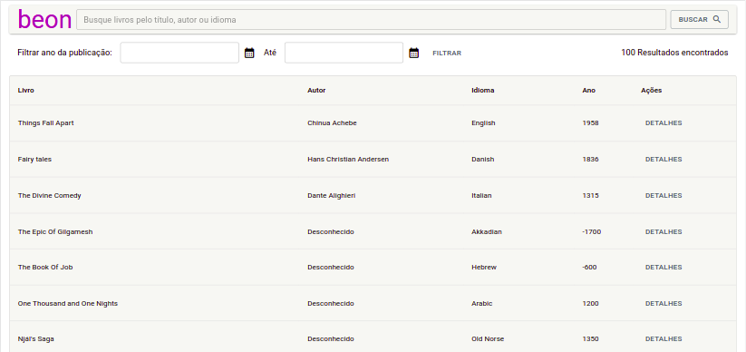

<p align="center">
  <h2 align="center">Quick Library</h2>

  <p align="center">
    Página de listagem e pesquisa
  </p>
</p>

<p align="center">
  
</p>

---

<h2>Sobre</h2>
<p align="center">
A aplicação é uma landing page de pesquisa de livros que possui em sua tela principal uma barra de pesquisa, uma barra de filtro por data e uma lista paginada de livros.
</p>

<h3 id="techs">Tecnologias</h3>
  
<div>
  
  
  
  
  
</div>

<p>A estilização foi feita utilizando a biblioteca <a href="https://mui.com/pt/">MUI</a>.</p>

---

<h3>Importante! Siga as instruções <a href="https://github.com/beonica/jsonserver">desse link</a> para executar a API na sua máquina.</h3>

Antes de prosseguir, certifique-se de que a api está sendo executada em sua máquina!

> > Essa aplicação já está hospedada em um servidor, portanto a partir daqui já é possível visualizar o funcionamento da mesma clicando <a href="http://quick-library.vercel.app/">aqui</a>. Ainda assim você pode prosseguir com o tutorial para executar a aplicação em sua máquina!

<h2>Instruções para executar a aplicação na sua máquina:</h2>

1. Clone o repositório (exemplo SSH) - insira no console:

```sh
git clone git@github.com:felipelouzeiro/quick-library.git
```

2. Instale as dependências do projeto:

```sh
cd quick-library/
npm install
```

3. Execute a aplicação:

```sh
npm start
```

Et voilà! a aplicação já deverá está funcionando!

---

<h3>Fique à vontade para contribuir com melhorias!</h3>

Próximos passos:

- Ajustar filtro
- Testes unitários/integração
- Formatar o db, id's..

Aqui estão algumas instruções para sua contribuição:

1.  Faça o Fork da aplicação.

2.  Crie a sua ramificação:

```sh
git checkout -b feature:
```

3.  Envie suas alterações.

```sh
git commit -m 'Segue algumas melhorias!'
```

4.  Envie para o repositório remoto.

```sh
git push origin feature
```

5.  Por fim, abra um Pull Request, você pode descrever suas alterações nele.

---

> > Feito com carinho por [felipelouzeiro <3](https://www.linkedin.com/in/felipelouzeiro/).
